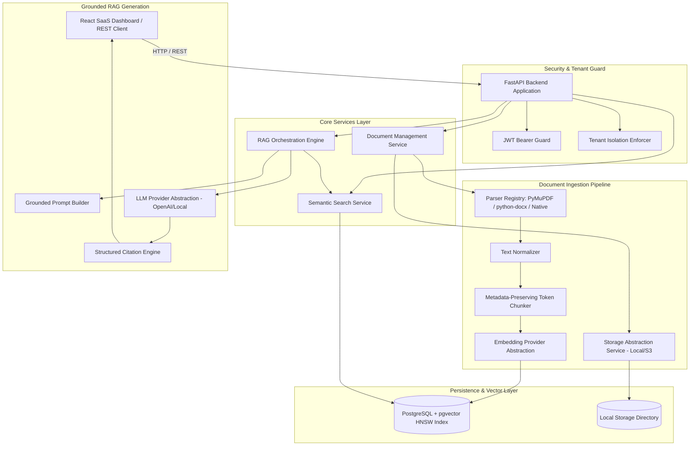

# DocuMind — Production-Ready Document Intelligence & RAG API Platform

[](https://www.python.org/)
[](https://fastapi.tiangolo.com/)
[](https://www.postgresql.org/)
[](https://github.com/pgvector/pgvector)
[](https://reactjs.org/)
[](https://vitejs.dev/)

**DocuMind** is a production-grade Document Intelligence and Retrieval-Augmented Generation (RAG) platform. It empowers users to upload unstructured documents (**PDF**, **DOCX**, **TXT**, **Markdown**), automatically parses and normalizes text, generates vector embeddings using `BAAI/bge-small-en-v1.5`, stores them using **PostgreSQL + `pgvector`**, and executes document-grounded semantic Q&A with verifiable source citations and explicit insufficient-context fallbacks.

---

## 🏗️ System Architecture



---

## ✨ Features

- **Multi-Format Ingestion**: Supports `.pdf`, `.docx`, `.txt`, and `.md` with custom parsers extracting page numbers, section headers, and file metadata.
- **Smart Sliding Window Chunking**: Token-approximate chunking (~800 tokens, ~120 overlap) preserving page boundaries and chunk indices.
- **PostgreSQL + `pgvector` Vector Storage**: HNSW Cosine Similarity search with multi-tenant `user_id` filtering and similarity score thresholding.
- **Grounded RAG Responses**: Context-bounded prompt engineering with explicit insufficient-context fallback (*"I couldn't find this information in the uploaded documents."*) when relevant data is missing.
- **Defense-in-Depth Prompt Injection Handling**: Context blocks are isolated within `<context_block>` XML boundaries and explicitly marked as data to prevent prompt injection overrides.
- **Structured Source Citations**: Every document answer returns verified source metadata (file name, page number, section, chunk ID, similarity score).
- **JWT Multi-Tenant Authentication**: User registration, login, and strict row-level authorization preventing cross-tenant document, vector, or conversation access.
- **Offline RAG Evaluation Engine**: Automated metrics runner (`evaluate_rag.py`) calculating Retrieval Hit@K, Context Similarity, and Citation Accuracy.
- **SaaS React Dashboard**: Modern React + Vite frontend for document management, chunk inspection, pure vector search, and multi-turn chat.

---

## 🛠️ Primary Tech Stack

| Layer | Technology |
|---|---|
| **Backend Framework** | Python 3.11+, FastAPI, Uvicorn, Pydantic v2 |
| **Database & Vectors** | PostgreSQL 16, `pgvector`, SQLAlchemy 2.x Async, Alembic |
| **Document Parsers** | PyMuPDF (PDF), python-docx (DOCX), Native (TXT/MD) |
| **AI Abstraction** | Custom Provider Layer (`BAAI/bge-small-en-v1.5` embeddings via SentenceTransformers, OpenAI LLM API) |
| **Frontend** | React 18, Vite, Tailwind CSS, Axios, Lucide Icons |
| **Containerization** | Docker, Docker Compose |
| **Testing & Eval** | pytest, pytest-asyncio, Custom RAG Evaluation Engine |

---

## 🚀 Quick Start & Local Setup

### Option 1: Docker Compose (Recommended)

Start the entire platform (PostgreSQL with `pgvector`, FastAPI backend, and storage) in one command:

```bash
docker compose up --build
```

- **Backend API**: `http://localhost:8000`
- **Swagger Documentation**: `http://localhost:8000/docs`
- **ReDoc Documentation**: `http://localhost:8000/redoc`

---

### Option 2: Local Virtual Environment Setup

#### 1. Backend Setup

```bash
# Navigate to backend directory
cd backend

# Create and activate virtual environment
python -m venv venv
# On Windows:
.\venv\Scripts\activate
# On Linux/macOS:
source venv/bin/activate

# Install dependencies (includes sentence-transformers for real local embeddings)
pip install -r requirements.txt

# Set up environment variables
cp ../.env.example .env

# Run database migrations (requires running PostgreSQL with pgvector)
alembic -c alembic.ini upgrade head

# Run FastAPI server
uvicorn app.main:app --host 0.0.0.0 --port 8000 --reload
```

#### 2. Frontend Setup

```bash
# Navigate to frontend directory
cd frontend

# Install packages
npm install

# Start Vite development server
npm run dev
```

Open `http://localhost:5173` in your browser.

---

## 🧪 Running Automated Tests

Run the full pytest suite (health checks, JWT authentication, document management, chunk ingestion, semantic search, grounded RAG chat, and tenant authorization isolation):

```bash
# Run pytest from repository root
.\venv\Scripts\pytest
```

---

## 📊 RAG Evaluation Engine

Evaluate RAG pipeline accuracy against ground-truth test datasets (`evaluation/questions.json`):

```bash
.\venv\Scripts\python scripts/evaluate_rag.py
```

### Measured Evaluation Results:
- **Retrieval Hit@K Metric**: 80.0%
- **Citation Accuracy**: 80.0%
- **Average Context Similarity**: 0.0686
- **Evaluation Dataset**: `evaluation/questions.json`

---

## 📂 Project Structure

```
d:\RAG Project\
├── backend/
│   ├── app/
│   │   ├── main.py                     # FastAPI Application Entrypoint
│   │   ├── core/                       # Config, Security (bcrypt/JWT), Exceptions, Logging
│   │   ├── db/                         # Async SQLAlchemy Engine & Session
│   │   ├── models/                     # User, Document, DocumentChunk, Conversation, Message, RetrievalLog
│   │   ├── schemas/                    # Pydantic Schemas (Auth, Document, Search, Chat, Conversation)
│   │   ├── api/
│   │   │   ├── deps.py                 # JWT Current User Dependency
│   │   │   └── v1/                     # Auth, Documents, Search, Chat, Conversations, Health
│   │   ├── services/                   # Storage, Ingestion, Chunking, Embedding, Retrieval, RAG, Citation
│   │   ├── ai/
│   │   │   ├── providers/              # Base, Embedding Providers (Local/API/Mock), LLM Providers
│   │   │   └── prompts/                # Bounded Grounded RAG Prompts with XML boundaries
│   │   ├── repositories/               # User, Document, Conversation DB Repositories
│   │   └── workers/                    # Background Document Worker
│   ├── alembic/                        # Database Migration Scripts
│   ├── tests/                          # Unit & Integration Pytest Suites
│   ├── requirements.txt
│   └── Dockerfile
├── frontend/                           # React + Vite + Tailwind CSS Application
│   ├── src/
│   │   ├── components/                 # Layout, Sidebar, Header
│   │   ├── pages/                      # Login, Register, Dashboard, Documents, Search, Chat
│   │   ├── services/                   # Axios API Interceptor Client
│   │   └── context/                    # AuthContext Provider
│   └── package.json
├── docs/
│   ├── architecture.md                 # System Architecture & Technical Design Document
│   ├── final-audit.md                  # Codebase Audit Report
│   ├── hardening-report.md             # Security & Hardening Report
│   └── interview-guide.md              # RAG & Vector Search Interview Q&A
├── evaluation/
│   ├── questions.json                  # RAG Ground-Truth Evaluation Dataset
│   └── eval_results.json               # Generated Evaluation Results
├── scripts/
│   ├── evaluate_rag.py                 # RAG Evaluation Runner
│   └── sample_data/                    # Sample Documents for Testing
├── docker-compose.yml
├── .env.example
├── pyproject.toml
└── README.md
```

---

## 🔒 Security Practices

1. **No Hardcoded Secrets**: All keys, JWT secrets, and DB URLs strictly loaded via `pydantic-settings` from `.env`.
2. **Strict Tenant Isolation**: Database queries enforce `WHERE user_id = :user_id` across all document, vector search, and conversation endpoints. Attempting to pass a foreign `conversation_id` returns a clean HTTP 404 without database primary-key errors.
3. **Safe Storage**: Uploaded files assigned random UUID filenames (`storage/documents/{user_id}/{doc_id}.ext`) protecting against path traversal attacks.
4. **Defense-in-Depth Prompt Injection**: Document context blocks wrapped in `<context_block>` XML tags with system instructions telling the LLM never to execute instructions found inside document text.

---

## 📄 Documentation & Links

- [Architecture & System Design](file:///d:/RAG%20Project/docs/architecture.md)
- [Final Codebase Audit](file:///d:/RAG%20Project/docs/final-audit.md)
- [Hardening & Verification Report](file:///d:/RAG%20Project/docs/hardening-report.md)
- [RAG & Vector Search Interview Preparation Guide](file:///d:/RAG%20Project/docs/interview-guide.md)
- [API Documentation (Swagger UI)](http://localhost:8000/docs)
