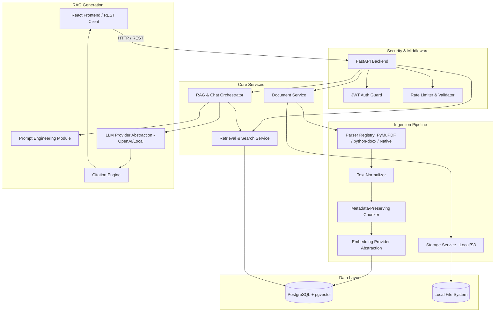
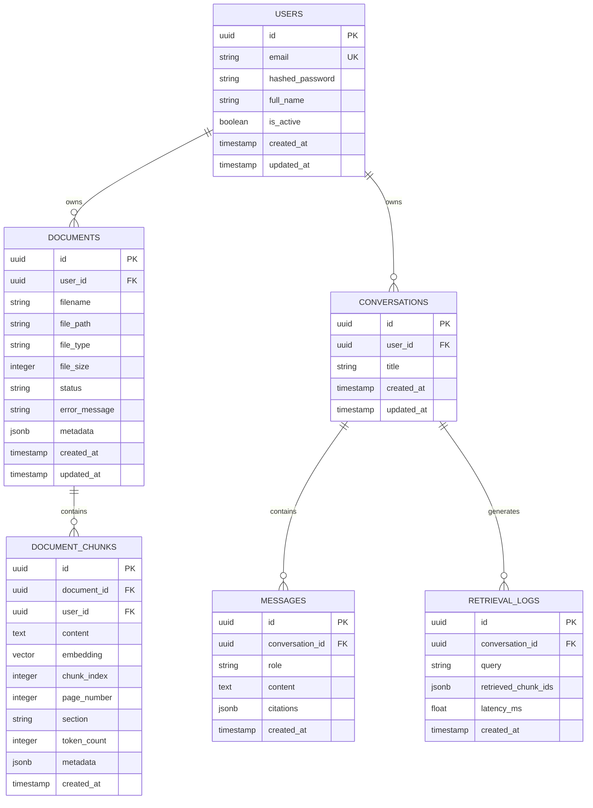

# DocuMind — Architecture & System Design Document

## 1. Executive Summary & System Requirements

**DocuMind** is a production-ready Document Intelligence and Retrieval-Augmented Generation (RAG) platform. It allows users to upload unstructured documents (PDF, DOCX, TXT, Markdown), parse and chunk them, generate vector embeddings, store them using PostgreSQL with `pgvector`, and execute semantic questions against the document corpus with exact citations and hallucination fallbacks.

### Functional Requirements
* **Multi-Format Ingestion**: Upload, validate, extract, and clean text from PDF, DOCX, TXT, and Markdown files.
* **Smart Chunking**: Split text into configurable token windows (~800 tokens, ~120 overlap) preserving page numbers, section headers, chunk indices, and file metadata.
* **Vector Storage & Search**: PostgreSQL + `pgvector` with cosine similarity, configurable similarity threshold, top-k retrieval, and metadata filtering.
* **Grounded RAG Pipeline**: Context-bounded prompt engineering enforcing zero-hallucination fallback ("Information not found in context") and structured citations (file name, page number, chunk ID).
* **Multi-Turn Chat History**: Windowed conversation memory preserving context across queries.
* **User Authentication & Isolation**: JWT authentication with strict tenant isolation (users access only their own documents and conversations).
* **Evaluation Framework**: Offline RAG evaluation runner evaluating Retrieval Hit@K, Context Relevance, and Citation Correctness.
* **Modern Web Dashboard**: SaaS-style React (Vite + Tailwind CSS) interface for document management, search, and document-grounded chat.

---

## 2. System Architecture & Data Flow

### Document Ingestion Flow
1. User POSTs file to `/api/v1/documents/upload`.
2. File payload validated (type, size max limit, filename sanitization).
3. Document metadata created in DB with status `PROCESSING`. File written to disk storage.
4. Extractor parses raw text and extracts page/section layout.
5. Text cleaning normalizes whitespace and encoding artifacts.
6. Chunker splits text into token windows (~800 tokens) retaining page and chunk metadata.
7. Embedding provider converts chunks to vector representations in batches.
8. Chunks and vector embeddings saved to `document_chunks` table in PostgreSQL (`pgvector`).
9. Document status updated to `READY`.

### RAG Query & Citation Flow
1. User sends message to `/api/v1/chat`.
2. System fetches windowed message history for the conversation.
3. Query preprocessed and embedded via `EmbeddingProvider`.
4. Cosine similarity query against `document_chunks` scoped to `user_id` (and optional document filters).
5. Low-similarity chunks filtered out based on similarity threshold (e.g., > 0.70).
6. Prompts constructed using strictly bounded system prompt with retrieved context blocks.
7. LLM provider generates completion.
8. Citation Engine extracts source metadata (filename, page number, chunk ID, similarity) from context blocks used in the generation.
9. Structured response returned with answer text and array of source citations.

---

## 3. Database Schema

### Entity-Relationship Diagram

---

## 4. API Design Specifications

### Authentication
* `POST /api/v1/auth/register`: Register a new user (`email`, `password`, `full_name`).
* `POST /api/v1/auth/login`: Authenticate user and return OAuth2 JWT token.
* `GET /api/v1/auth/me`: Get profile of authenticated user.

### Document Management
* `POST /api/v1/documents/upload`: Upload file (`PDF`, `DOCX`, `TXT`, `MD`). Returns document record with status `PROCESSING`.
* `GET /api/v1/documents`: List documents owned by user with pagination and status filter.
* `GET /api/v1/documents/{document_id}`: Detailed metadata & status of specific document.
* `DELETE /api/v1/documents/{document_id}`: Delete document, associated file from storage, and all chunks from vector DB.
* `GET /api/v1/documents/{document_id}/chunks`: View extracted chunks and token metadata for inspection.

### Chat & RAG
* `POST /api/v1/chat`: Send message to conversation. Parameters: `conversation_id` (optional, created if null), `message`, `document_ids` (optional filter).
* `GET /api/v1/conversations`: List user conversations.
* `GET /api/v1/conversations/{conversation_id}`: Get message history and citations for a conversation.
* `DELETE /api/v1/conversations/{conversation_id}`: Delete conversation history.

### Search
* `POST /api/v1/search`: Pure semantic search endpoint (`query`, `top_k`, `document_ids`, `similarity_threshold`).

### System & Health
* `GET /health` & `GET /api/v1/health`: Service status check (Database connection, Embedding model ready, Vector DB active).
* `GET /api/v1/metrics`: Summary system stats (documents count, total chunks, queries handled).

---

## 5. Technology Decisions & Trade-Offs

| Decision | Selection | Alternatives Considered | Justification / Trade-off |
|---|---|---|---|
| **Vector DB** | PostgreSQL + `pgvector` | Pinecone, Qdrant, Chroma | Single DB for transactional and vector data simplifies ACID compliance, data isolation, backup, and local Docker deployment without extra SaaS cost. |
| **Parsing** | PyMuPDF + python-docx | Unstructured, LlamaParse | PyMuPDF is extremely fast, accurate for text position/page extraction, and has no external API dependencies. |
| **Embedding Model** | `BAAI/bge-small-en-v1.5` (via SentenceTransformers / FastEmbed / API Abstraction) | OpenAI `text-embedding-3-small` | `bge-small-en-v1.5` produces high-quality 384-dim embeddings locally with low latency and memory usage. Abstraction allows seamless toggle to OpenAI API. |
| **LLM Provider** | OpenAI Compatible Provider (`httpx`) | LangChain / LlamaIndex | Direct lightweight async wrapper avoids framework bloat, complex abstractions, and magic defaults while maintaining full control over prompts and context windows. |
| **Task Processing** | FastAPI `BackgroundTasks` (Modularized for Celery/RQ) | Celery + Redis | `BackgroundTasks` keeps early MVP zero-dependency and simple to run, while worker functions are written cleanly to be drop-in ready for Celery/RQ task queues. |

---

## 6. Security & Tenant Isolation
1. **Tenant Isolation**: Every database query on `documents`, `document_chunks`, `conversations`, and `messages` enforces `WHERE user_id = :user_id`.
2. **Path Traversal Protection**: Uploaded files are assigned random UUID filenames on disk (`storage/documents/{user_id}/{document_id}.ext`), ignoring original client filenames.
3. **Secret Security**: No hardcoded API keys or secrets. Strict validation via `pydantic-settings` from `.env`.
4. **Input Validation**: Strict MIME-type and file header checks before processing files.
